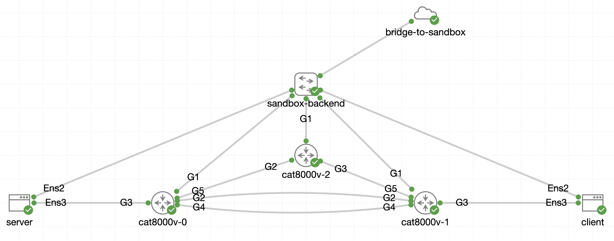
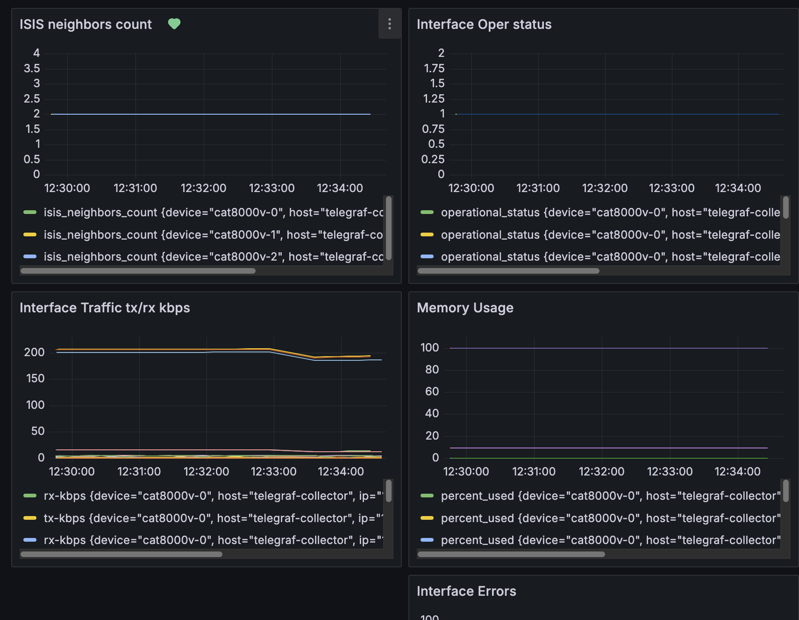
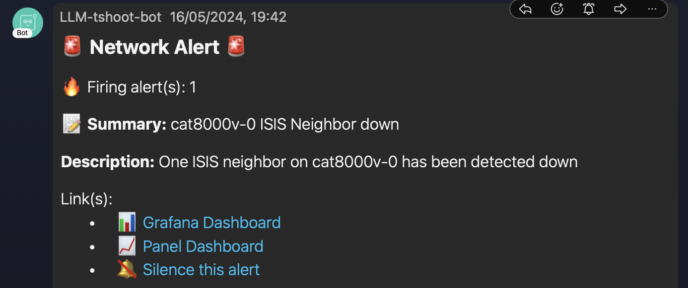

# Network Observability TIG Demo

This project provides a **Telegraf, InfluxDB, and Grafana (TIG)** stack to monitor a small CML network running ISIS. I use these components as part of demos for AI agents that I built.

> [!NOTE]
> I won’t be adding new features on request. If you need more features, go ahead and fork the repo.

## Scenario

The stack monitors a small CML network running ISIS


- **Telegraf** collects metrics via NETCONF (powered by [ncpeek](https://github.com/jillesca/ncpeek)).
- **InfluxDB** stores these metrics.
- **Grafana** visualizes telemetry data and alerts on specific conditions.

## Grafana Dashboard



## Grafana Alert

There is one alert that is defined in [alerts.yaml](grafana/config/alerts.yaml):

```bash
if avgNeighbors(30sec) < avgNeighbors(30min) : send Alarm​
```

When the average number of ISIS neighbors in a lapse of 30 second _**is less than**_ the average number of ISIS neighbors in a lapse of 30 minutes, the _alarm triggers a webhook_ for the agent to start working.

You can update the [Grafana contact points](grafana/config/contact_points.yaml) if you want to send an alert to another system.

### 📌 Webhooks (Optional)

There are two contact points for generic webhooks. The `GRAFANA_WEBHOOK` and `GRAFANA_WEBHOOK2` are available.:

```bash
GRAFANA_WEBHOOK=<WEBHOOK_URL>
GRAFANA_WEBHOOK2=<WEBHOOK_URL2>
```

For instance, you could point alerts to <https://webhook.site/> for quick testing and use the second webhook for a system you are working on.

## 🛠️ Setup

1. **Provision CML lab (optional)**

   - If you don't have a CML instance that you can use either the [DevNet CML Sandbox](https://devnetsandbox.cisco.com/DevNet/) or use the [CML free version](https://developer.cisco.com/docs/modeling-labs/cml-free/) which gives you up to 5 nodes to run simultaneously. Run the [CML topology](cml/topology.yaml).
   - Otherwise, the TIG stack can still run, but you need to update IPs/credentials in Telegraf’s [JSON config files](telegraf/config/) and `netconf.conf` with your own devices.

2. **Requirements**

   - Docker Compose V2. Aka, `docker compose` instead of `docker-compose`.

3. **Build and Run**

   - To build the containers for the first time:

     ```bash
     make build-tig
     ```

   - To rerun them:

     ```bash
     make run-tig
     ```

   - To remove the containers:

     ```bash
     make clean-tig
     ```

### 🚦 Verifying

- **Telegraf logs**

  ```bash
  docker exec -it telegraf bash
  tail -F /tmp/telegraf-grpc.log
  ```

- **InfluxDB**
  - `http://<SERVER_IP>:8086` (credentials `admin`/`admin123`).
- **Grafana**
  - `http://<SERVER_IP>:3000` (credentials `admin`/`admin`).
  - Dashboard under `General > Network Telemetry`.

## Appendix

### Why `.env.example`?

This project needs certain environment variables to run. The `.env.example` file is a template that shows what’s required.

If you need to store sensitive info, create your own `.env` file (it’s in `.gitignore`) to avoid committing secrets.

### 📝 Webex notification (Optional)

To enable Webex alerts, create a `.env` file with:

```bash
WEBEX_TEAMS_ACCESS_TOKEN=<YOUR_TEAM_ACCESS_TOKEN>
WEBEX_APPROVED_USERS_MAIL=<MAILS_OF_USERS_APPROVED_SEPARATED_BY_COMMAS>
WEBEX_USERNAME=<YOUR_WEBEX_USERNAME>
WEBEX_ROOM_ID=<THE_WEBEX_ROOM_ID>
```

Create a bot and its token at <https://developer.webex.com/docs/bots>

Create a room in the Webex app, then use the [rooms API](https://developer.webex.com/docs/api/v1/rooms/list-rooms) to find your `WEBEX_ROOM_ID`.

Here is an example of the Webex alert that is sent by Grafana.


